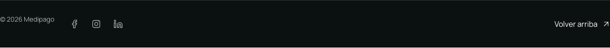
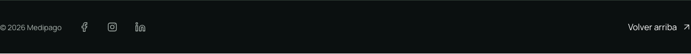
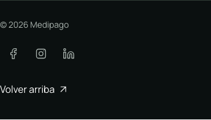
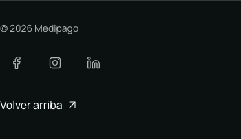

# Alineación de redes en el pie de Medipago

Fecha: 2026-10-04. Continuación desde `origin/main` (`0637ae0`), rama
`fix/medipago-footer-social-alignment`. El PR original de redes #134 ya estaba
mergeado; su worktree se conservó sin cambios.

## Problema y cambio

En `https://medipago.gt/`, el copyright quedaba 10,5 px por encima del centro de
los íconos sociales. La franja era flex sin alineación vertical: estiraba el
`span` hasta los 44 px de los enlaces, pero su texto de 23,1 px seguía arriba.
Medir sólo las cajas habría ocultado el fallo, porque todas medían 44 px.

- `photographic-service.css`: centra los elementos de la franja en escritorio.
- `SocialLinks.astro`: separa 8 px los controles del perfil fotográfico y amplía
  a 48 × 48 px sus áreas táctiles en móvil. Los SVG siguen midiendo 20 × 20 px.
- Se conserva el anillo de foco `currentColor`, los colores, Manrope, el orden
  y los destinos declarados por el tenant. La composición móvil sigue apilada.
- `tests/social-links.spec.ts`: mide la caja del texto con `Range`, no la caja
  estirada del `span`, y comprueba geometría móvil. Primero falló con 10,5 px;
  pasó tras corregir la alineación.

No se escribieron configuraciones ni datos remotos. El ajuste es de presentación
del perfil fotográfico; no activa módulos ni cambia redes o identidad.

## Revisión visual

Producción y build local se revisaron a 1440 × 900 y 390 × 844. El servidor local
en `http://medipago.gt:4485/` usó la API pública real en modo lectura
(`SITE_MANIFEST_SOURCE=api`, `SITE_API_BASE_URL=https://api.1platform.pro`), con
el host resuelto a loopback sólo en Chromium. No hubo fixtures ni interceptores
en estas capturas. Esto verifica el renderer y contenido publicados, no el banco
privado de persistencia/autenticación.

Todas las capturas se abrieron individualmente. Se esperó `document.fonts.ready`
y que `document.getAnimations()` no tuviera animaciones activas.

| Pantalla | Antes | Después |
| --- | --- | --- |
| 1440 px, pie y franja | Copyright alto; tres íconos con línea inferior. Sin recortes ni overflow. | Copyright e íconos centrados: diferencia residual 0,047 px. Separación uniforme y acción de regreso conservada. |
| 390 px, viewport y franja | Copyright, redes y regreso en tres filas legibles; controles de 44 px. | Tres filas conservadas, controles de 48 px y espacio de 8 px entre ellos. Sin superposición ni overflow en la franja. |

Las capturas largas del footer móvil incluyen la cabecera fija superpuesta a la
parte superior, igual antes y después. Para revisar las redes sin ese efecto del
encuadre se incluyen capturas del viewport y de la franja `.footer-bottom`.
No hay estados de carga, error o vacío nuevos: sin redes válidas el componente
sigue sin renderizarse, cubierto por los tests existentes de los tres pies.

Evidencia local durable:
`/Users/staimer/Documents/1platform-worktrees/.bench-medipago-footer-social/`.

- `production-{1440,390}-{footer,viewport,strip}.png`: lectura de producción.
- `before-{1440,390}-{footer,viewport}.png`: build de main antes del cambio.
- `after-{1440,390}-{footer,viewport,strip}.png`: build con el ajuste.
- `production-metrics.json`, `before-metrics.json`, `after-metrics.json`.
- `capture.mjs`: captura reproducible, con los destinos y medidas verificables.

Pares versionados para la revisión del PR:

| Ancho | Producción | Ajuste local |
| --- | --- | --- |
| 1440 px |  |  |
| 390 px |  |  |

Contexto completo: [pie en escritorio](medipago-footer-social-2026-10-04/after-1440-footer.png)
y [viewport móvil](medipago-footer-social-2026-10-04/after-390-viewport.png).

## Validación

- `npm run build`: correcto.
- `npm run check`: guard correcto y 53/53 self-tests correctos.
- `npm run typecheck`: 0 errores, 0 warnings, 27 hints preexistentes.
- `PLAYWRIGHT_PORT=4486 npm test -- --workers=4`: 506 correctos; 24 casos del
  banco privado omitidos por falta de su entorno, como establece la suite.
- `npm run test:visual`: 8/8 comparaciones Linux correctas, sin cambiar PNGs.
- Línea base HTML re-congelada con `freeze-baseline.mjs`: 100 rutas conservadas
  (51 respuestas 200, 48 redirecciones, 1 respuesta 404). Se verificó cada cuerpo
  modificado: las 51 diferencias corresponden sólo a hashes de `BaseLayout` y
  `photographic-service`, usando los normalizadores existentes sin cambiarlos.
  `baseline-review.json` conserva el resultado. El comparador final da
  100 idénticas, 0 diferentes, 0 estados/destinos incorrectos; su control
  discriminante pasa 15/15 aserciones.
- `PORT=4488 npm run check:baseline`: correcto sobre build y proceso nuevos.
- `git diff --check`: correcto.

La validación de producción anterior sólo reproduce el problema: este cambio
no se ha mergeado ni desplegado.

Un intento de congelado con un proceso anterior al build Linux se rechazó por
importaciones dinámicas obsoletas y estados 503; no se aceptó como baseline. Se
restauró la copia original y se repitió con build y proceso nuevos, conservando
los 100 resultados esperados. Los builds que comparten `dist/` y sus procesos
de servidor deben ejecutarse de forma secuencial.

## Guías del repositorio

`AGENTS.md` y `CLAUDE.md` del workspace permanecen sin cambios y sincronizados.
No cambia ningún hecho transversal. La guía local y README dicen Astro 5/static
y ausencia de CI de PR, pero el manifest y workflows actuales usan Astro 7.2.10,
adapter Node SSR y CI de PR. Esta revisión usa los comandos/configuración reales;
la corrección documental general queda fuera de este ajuste de pie.
